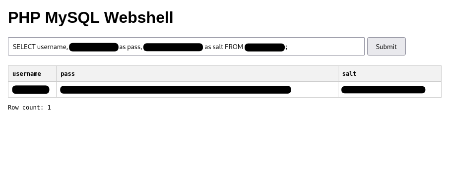

# PHP-MySQL-webshell

A simple webshell for performing arbitrary queries to a MySQL database. Perfect for when you can upload a webshell, but can't (or don't want to) form a tunnel.

---



## USAGE

You must already have credentials for MySQL. There is no exploit here; it's basically just a webshell.

Clone this repo and substitute in your database credentials:

```php+html
// ...
$databaseServer = 'localhost';
$databaseUsername = 'root';
$databasePassword = 'root';
$databaseName = 'mywebapp';
// ...
```

> :bulb: Alternatively, use an existing connection that was formed in other code via an `include`.

Find a way to upload your webshell. 

Visit the page and enter any queries into the input bar :sunglasses:

----

I hope you find this useful. Please give this repo a :star: if you enjoy it.

:handshake::handshake::handshake::handshake:

4wayhandshake
